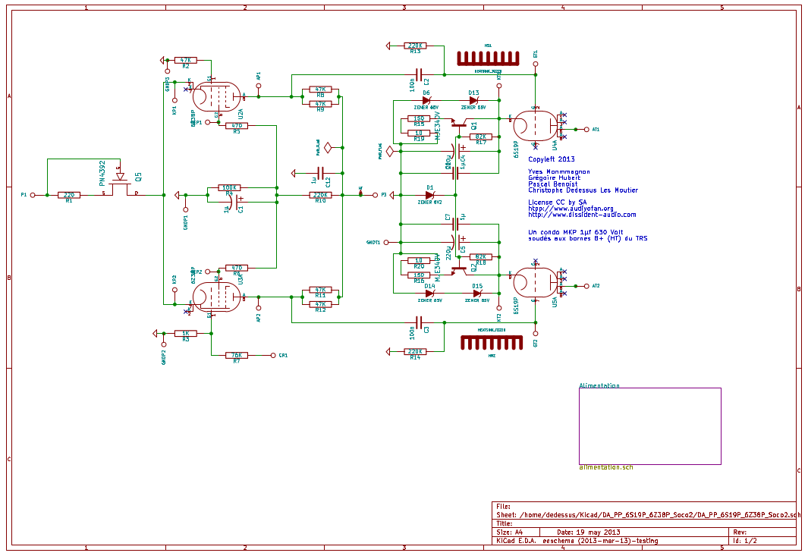
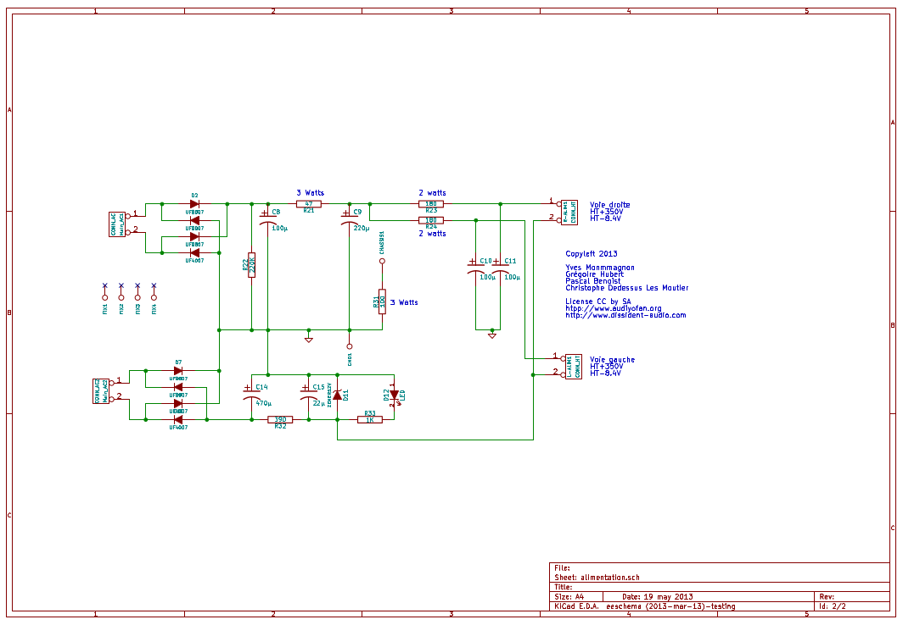
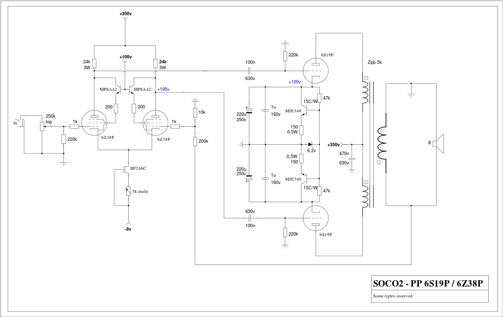
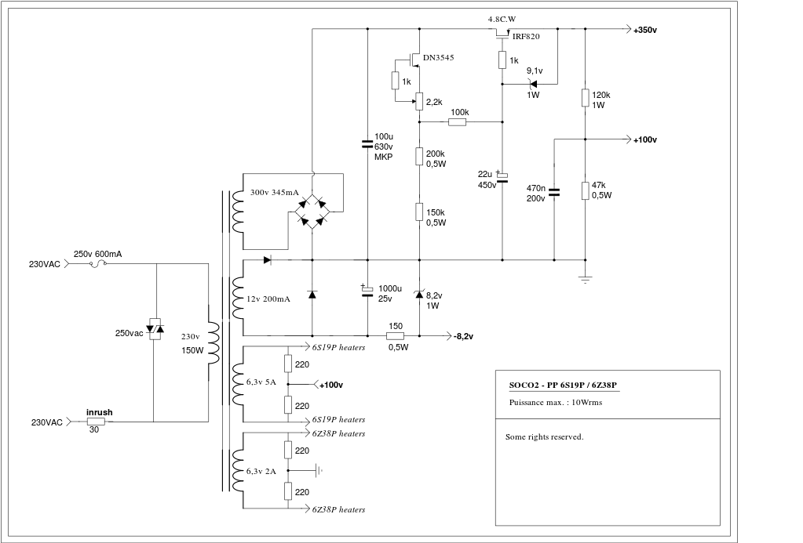

=========================
SOCO2 PUSH PULL AMPLIFIER
=========================

Project authors:

- Pascal Benoist
- Grégoire Hubert
- Christophe Dedessus Les Moutier
- Yves Monmagnon

See http://audiyofan.org 

More information here http://www.audiyofan.org/forum/viewtopic.php?f=60&t=8371

Presentation
------------

Soco2 is a valve push-pull type amplifier delivering 10W in 8ohms with a low output impedance. It uses cheap Russian 6C19Π low impedance triodes as output valve and can be used without global feedback.

The built_version
------------------

The project was made on printed circuit board ( all files are included in Kicad folder )
This version does not use the PNK, the 6S19P's CCS is decoupled and has zener protection that prevents slippage cathode voltage on the higer swing
Power is succinct and yet respects the constants time
Local feedback of -1 dB, improve the damping factor

Warning
-------

This schematic implies the use of **lethal voltages**. Maximum precautions must be observed when working with this kind of high voltages. Authors are **not** responsible in any way for any problems, damages or injuries that would result in the making of the work and / or use of this schematic (see LICENCE file).

Results
-------

Realisations emitted very natural, detailed and transparent sound with nice deep bass using speakers as low as 90dB/W/m. Measures showed -74dB THD for 1/2W output and -65dB THD for 1W (H2 and H3) with matched tubes. Output can reach 13W with -40dB THD in 8Ω. 
    

